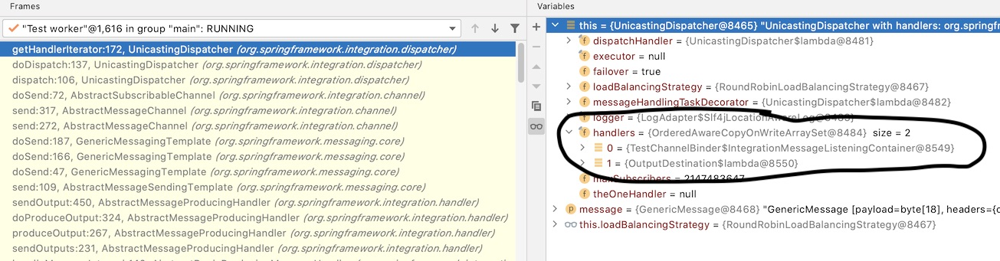

# Example project to triage potential issue with TestChannelBinderConfiguration

See also: https://stackoverflow.com/questions/66014145/using-testchannelbinderconfiguration-but-two-handlers-get-registered

To reproduce:

- run TestChannelBinderTriageApplicationTests
- test fails
- Set breakpoint in org.springframework.integration.dispatcher.UnicastingDispatcher.getHandlerIterator() line #172 
  
There you can see that two handlers are registered with round robin load balancing strategy, therefore the second message is not consumed in the test.

